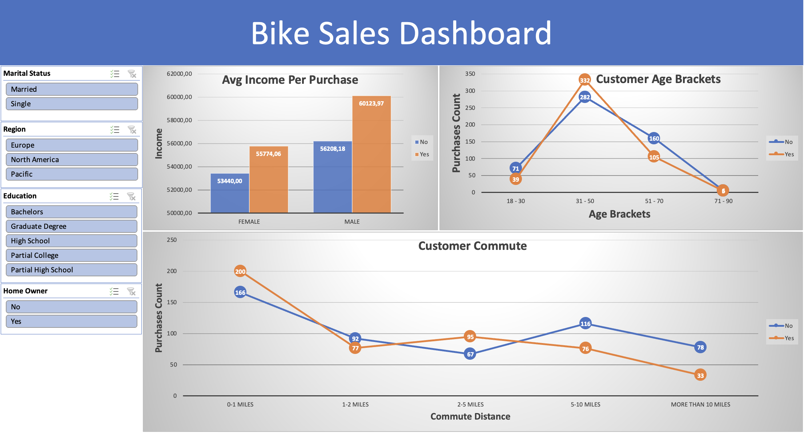

# Bike-Sales-Analysis
This project focuses on analyzing the Bike Sales Dataset using Excel for a comprehensive data analysis. With 1026 rows and various variables, this dataset offers a wealth of information for analysis and exploration. It covers a wide range of factors including customer demographics, purchase details, and other relevant features. The goal of this data analysis project is to gain insights into the factors influencing bike sales and understand the customer characteristics associated with bike purchases. By exploring the relationships between the variables and performing various analytical techniques, I aim to uncover patterns, trends, and potential opportunities for bike retailers.

## Variables
- **ID:** An identification number assigned to each customer.
- **Marital Status:** Indicates the marital status of the customer.
- **Gender:** Specifies the gender of the customer.
- **Income:** Represents the income level of the customer.
- **Children:** Indicates the number of children the customer has.
- **Education:** Specifies the educational background of the customer.
- **Occupation:** Represents the occupation of the customer.
- **Home Owner:** Indicates whether the customer owns a home or not.
- **Cars:** Specifies the number of cars owned by the customer.
- **Commute Distance:** Represents the commuting distance for the customer.
- **Region:** Indicates the geographical region where the customer resides.
- **Age:** Represents the age of the customer.
- **Purchased Bike:** Specifies whether the customer purchased a bike or not.

## Conclusions

